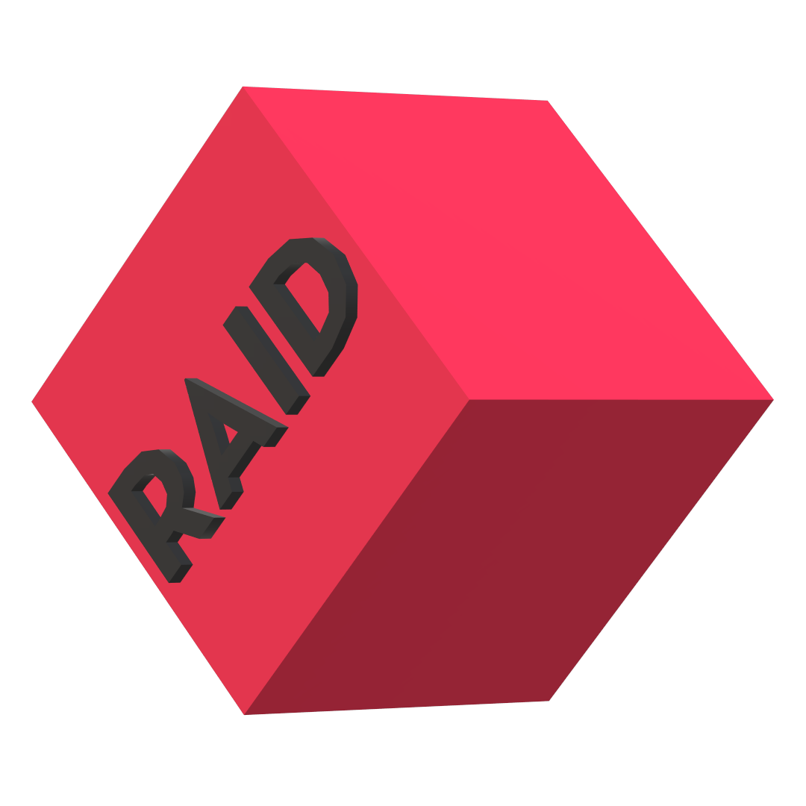

# R# - RSX
An interpreted statically typed multi paradigm general purpose programming language designed for cross platform applications.

# RSX Logo


# RSX Icon


# Requirements
- Python 3.10 or higher

# Getting Started
## How to install
### Windows (Compiles RSX source files and places them in C:\RSX, also installs the RSX python library)
```
.\install.bat
```

### Linux (Compiles RSX source files and installs the RSX python library)
```
./install.sh
```

### Difference between rsxpy and rsx
- rsx only works on Windows
- rsxpy requires python but rsx doesn't

## How to [run/build] a RSX program
```
[rsxpy/rsx] main.rsx [run/build]
```

## How to [run/build] a RSX bytecode
```
[rsxpy/rsx] main.rsxc [run/build]
```

## How to make a RSX library with python
### Using RSX Tools
```python
from rsxpy.tools import *

create_library("library")

@create_function("VOID", {"message": "STRING"})
def log(environment):
    print(environment["args"]["message"], flush = True)

library = pack_library()
```

### Using RSXLib
```python
from rsxpy import rsxlib

rsxlib.begin()

def log(message: str) -> None:
    print(environment["args"]["message"], flush = True)

rsxlib.end()
```

## How to make a RSX library with RSX header files
### library.rsxh
```c++
include "rsxio" : *;

void log(string message) {
    std::rout(message + std::endl());
}
```

### main.rsx
```c++
include "library.rsxh";

int main(string[] args) {
    library::log("Hello, World!");
}
```

## How to add an include folder
```
[rsxpy/rsx] main.rsx run -Imy-include-folder
```

# Command line arguments
- -I[dir]
- -rmI[dir]
- -timeit=[true/false]
- -gettok=[true/false]
- -getast=[true/false]
- -bytecode=[true/false]
- -noconsole=[true/false]
- -console=[true/false]
- run
- build

# Examples
## Hello, World!
```c++
include "rsxio" : *;

// using namespace std;

int main(string[] args) {
    std::rout("Hello, World!" + std::endl());
    return 0;
}
```

## Builder
```c++
include "rsxbuild", "rsxsys", "rsxio" : *;

int main(string[] args) {
    std::rout("file name > ");
    std::build_program(
        std::rin(),
        {std::getdir() + "/include/"},
        true, std::getdir() + "/icon.ico"
    ); return 0;
}
```

## Web Server
```c++
include "rsxsocket", "rsxio" : *;

int main(string[] args) {
    auto server = std::socket(std::AF_INET, std::SOCK_STREAM);
    std::bind(server, "localhost", 5656);
    std::listen(server);

    string index = "HTTP/1.1 200 OK\n\n<p>Hello, World!</p>";

    while (true) {
        auto connection = std::accept(server);
        string response = std::recv(connection, 1024);
        std::rout(response + std::endl());
        std::send(connection, index);
        std::close(connection);
    }
    
    return 0;
}
```

## Raylib
```c++
include "rsxraylib" : *;

int main(string[] args) {
    InitWindow(1200, 600, "R#");
    // SetTargetFPS(60);

    while (!WindowShouldClose()) {
        BeginDrawing();
        ClearBackground(RAYWHITE);
        DrawFPS(10, 10);
        EndDrawing();
    }

    CloseWindow();
    return 0;
}
```

## 3D Projection Using Raylib
```c++
include "rsxio", "rsxraylib" : *;

float[] project_vertices(float[] vertices, float[] position, float focal_length) {
    float[(int) (vertices.length() / 3 * 2)] projected_vertices;
    int index = 0;

    for (int i = 0; i < vertices.length(); i += 3) {
        if ((focal_length + (vertices[i + 2] + position[2])) == 0 || (focal_length * (vertices[i] + position[0])) == 0 || (focal_length * (vertices[i + 1] + position[1])) == 0)
            continue;
            
        float x_projected = (focal_length * (vertices[i] + position[0])) / (focal_length + (vertices[i + 2] + position[2]));
        float y_projected = (focal_length * (vertices[i + 1] + position[1])) / (focal_length + (vertices[i + 2] + position[2]));
        projected_vertices[index++] = x_projected; projected_vertices[index++] = y_projected;
    }

    return projected_vertices;
}

float[] scale_vertices(float[] vertices, float scale) {
    float[vertices.length()] new;

    for (int i = 0; i < vertices.length(); i++) {
        new[i] = vertices[i] * scale;
    }

    return new;
}

int main() {
    const int width = 1200, height = 600;
    InitWindow(width, height, "RSX");
    SetTargetFPS(60);

    float[] vertices = scale_vertices({
        -0.5f, -0.5f,  0.0f,
        -0.5f,  0.5f,  0.0f,
         0.5f,  0.5f,  0.0f,
         0.5f, -0.5f,  0.0f,
        -0.5f, -0.5f, -0.5f,
        -0.5f,  0.5f, -0.5f,
         0.5f,  0.5f, -0.5f,
         0.5f, -0.5f, -0.5f,
    }, 100);

    int[] indices = {
        0, 1,
        1, 2,
        2, 3,
        3, 0,
        4, 5,
        5, 6,
        6, 7,
        7, 4,
        0, 4,
        1, 5,
        2, 6,
        3, 7
    };

    int[] offset = {width / 2, height / 2};
    float[] position = {0.0f, 0.0f, 0.0f};
    float speed = 0.0f;

    float focal_length = 100.0f;

    while (!WindowShouldClose()) {
        BeginDrawing();
        ClearBackground(BLACK);
        DrawText((string) GetFPS() + " FPS", 10, 10, 20, RAYWHITE);

        float[] projected_vertices = project_vertices(vertices, position, focal_length);

        if (IsKeyDown(KEY_W)) position[2] -= speed;
        if (IsKeyDown(KEY_S)) position[2] += speed;
        if (IsKeyDown(KEY_A)) position[0] += speed;
        if (IsKeyDown(KEY_D)) position[0] -= speed;
        if (IsKeyDown(KEY_SPACE)) position[1] += speed;
        if (IsKeyDown(KEY_LEFT_SHIFT)) position[1] -= speed;
        if (IsKeyDown(KEY_LEFT_CONTROL)) speed = 3.0f;
        else speed = 2.0f;

        for (int i = 0; i < projected_vertices.length(); i += 2)
            DrawCircle(projected_vertices[i] + offset[0], projected_vertices[i + 1] + offset[1], 5, RAYWHITE);

        for (int i = 0; i < indices.length(); i += 2) {
            if (projected_vertices.length() >= indices[i] * 2) {
                DrawLine(projected_vertices[indices[i] * 2] + offset[0], projected_vertices[indices[i] * 2 + 1] + offset[1],
                         projected_vertices[indices[i + 1] * 2] + offset[0], projected_vertices[indices[i + 1] * 2 + 1] + offset[1], RAYWHITE);
            }
        }

        EndDrawing();
    }

    CloseWindow();
    return 0;
}
```

# The RSX Package Manager: Raid
A package manager for RSX

# Raid Logo


## How to install
Raid comes with RSX no need to install anything

### Difference between raidpy and raid
- raid only works on Windows
- raidpy requires python but raid doesn't

## How to create a new Raid project
```
[raidpy/raid] new console my_console_project
```

## How to [run/build] a Raid project
```
[raidpy/raid] [run/build] my_console_project
```

# Libraries
- rsxbuild
- rsxthread
- rsxio
- rsxf
- rsxgui
- rsxmath
- rsxmixer
- rsxrand
- rsxraylib
- rsxstr
- rsxstd
- rsxsys
- rsxterm
- rsxtime
- rsxos
- rsxsocket
- rsxsdl2