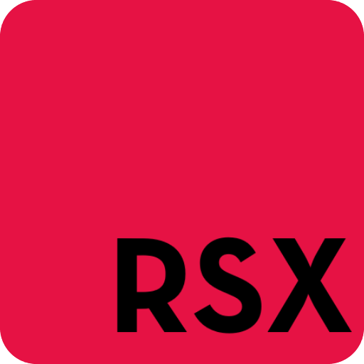

# R#
An interpreted statically typed multi paradigm general purpose programming language designed for cross platform applications.

# R# Logo


# R# Icon


# Getting Started
## How to install
### Windows
```
start install.bat
```

## How to run a program
```
python main.py main.rsx run
```

## How to build a program
```
python main.py main.rsx build
```

## How to run/build a R# bytecode
```
python main.py main.rsxc run/build
```

## How to make a library using python
### library.py
```python
from tools import *

create_library("library")

@create_function("VOID", {"message": "STRING"})
def log(environment):
    print(environment["args"]["message"], flush = True)

library = pack_library()
```

### main.rsx
```c++
include "library.py";

int main() {
    library::log("Hello, World!");
}
```

## How to make a library using R# header files
### library.rsxh
```c++
include "rsxio" : *;

void log(string message) {
    std::rout(message + std::endl()));
}
```

### main.rsx
```c++
include "library.rsxh";

int main() {
    library::log("Hello, World!");
}
```

## How to add an include folder
```
python main.py main.rsx run -Imy-include-folder
```

# Command line arguments
- -I[dir]
- -rmI[dir]
- -timeit=[true/false]
- -gettok=[true/false]
- -getast=[true/false]
- -bytecode=[true/false]
- -noconsole=[true/false]
- -console=[true/false]
- run
- build


# Examples
## Hello, World!
```c++
include "rsxio" : *;

// using namespace std;

int main() {
    std::rout("Hello, World!" + std::endl());
    return 0;
}
```

## Builder
```c++
include "rsxbuild" : *;
include "rsxsys" : *;
include "rsxio" : *;

int main() {
    std::rout("file name > ");
    std::build_program(
        std::rin(),
        std::getdir() + "\\include\\",
        true, std::getdir() + "\\icon.ico"
    ); return 0;
}
```

# Libraries
- rsxbuild
- rsxthread
- rsxio
- rsxf
- rsxgui
- rsxmath
- rsxmixer
- rsxrand
- rsxraylib
- rsxstr
- rsxstd
- rsxsys
- rsxterm
- rsxtime
- rsxos
- rsxsocket
- rsxsdl2 [indev]