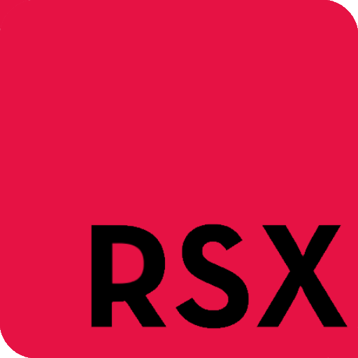

# R#
An interpreted statically typed multi paradigm general purpose programming language designed for cross platform applications.

# R# Logo


# R# Icon


# Requirements
- Python 3.10 or higher

# Getting Started
## How to install
### Windows (Compiles R# source files and places them in C:\RSX, also installs the R# python library)
```
.\install.bat
```

### Linux (Compiles R# source files and installs the R# python library)
```
./install.sh
```

## How to [run/build] a R# program
```
cd rsxpy
python core.py main.rsx [run/build]
```

## How to [run/build] a R# bytecode
```
cd rsxpy
python core.py main.rsxc [run/build]
```

## How to make a R# library with python
### Using R# Tools
```python
from rsxpy.tools import *

create_library("library")

@create_function("VOID", {"message": "STRING"})
def log(environment):
    print(environment["args"]["message"], flush = True)

library = pack_library()
```

### Using RSXLib
```python
from rsxpy import rsxlib

rsxlib.begin()

def log(message: str) -> None:
    print(environment["args"]["message"], flush = True)

rsxlib.end()
```

## How to make a R# library with R# header files
### library.rsxh
```c++
include "rsxio" : *;

void log(string message) {
    std::rout(message + std::endl());
}
```

### main.rsx
```c++
include "library.rsxh";

int main(string[] args) {
    library::log("Hello, World!");
}
```

## How to add an include folder
```
python main.py main.rsx run -Imy-include-folder
```

# Command line arguments
- -I[dir]
- -rmI[dir]
- -timeit=[true/false]
- -gettok=[true/false]
- -getast=[true/false]
- -bytecode=[true/false]
- -noconsole=[true/false]
- -console=[true/false]
- run
- build

# Examples
## Hello, World!
```c++
include "rsxio" : *;

// using namespace std;

int main(string[] args) {
    std::rout("Hello, World!" + std::endl());
    return 0;
}
```

## Builder
```c++
include "rsxbuild", "rsxsys", "rsxio" : *;

int main(string[] args) {
    std::rout("file name > ");
    std::build_program(
        std::rin(),
        {std::getdir() + "/include/"},
        true, std::getdir() + "/icon.ico"
    ); return 0;
}
```

## Web Server
```c++
include "rsxsocket", "rsxio" : *;

int main(string[] args) {
    auto server = std::socket(std::AF_INET, std::SOCK_STREAM);
    std::bind(server, "localhost", 5656);
    std::listen(server);

    string index = "HTTP/1.1 200 OK\n\n<p>Hello, World!</p>";

    while (true) {
        auto connection = std::accept(server);
        string response = std::recv(connection, 1024);
        std::rout(response + std::endl());
        std::send(connection, index);
        std::close(connection);
    }
    
    return 0;
}
```

## Raylib
```c++
include "rsxraylib" : *;

int main(string[] args) {
    InitWindow(1200, 600, "R#");
    // SetTargetFPS(60);

    while (!WindowShouldClose()) {
        BeginDrawing();
        ClearBackground(RAYWHITE);
        DrawFPS(10, 10);
        EndDrawing();
    }

    CloseWindow();
    return 0;
}
```

# The R# Package Manager: Raid
A package manager for R#

# Raid Logo


## How to create a new Raid project
```
cd rsxpy/raid
python core.py new console my_console_project
```

## How to [run/build] a Raid project
```
cd rsxpy/raid
python core.py [run/build] my_console_project
```

# Libraries
- rsxbuild
- rsxthread
- rsxio
- rsxf
- rsxgui
- rsxmath
- rsxmixer
- rsxrand
- rsxraylib
- rsxstr
- rsxstd
- rsxsys
- rsxterm
- rsxtime
- rsxos
- rsxsocket
- rsxsdl2